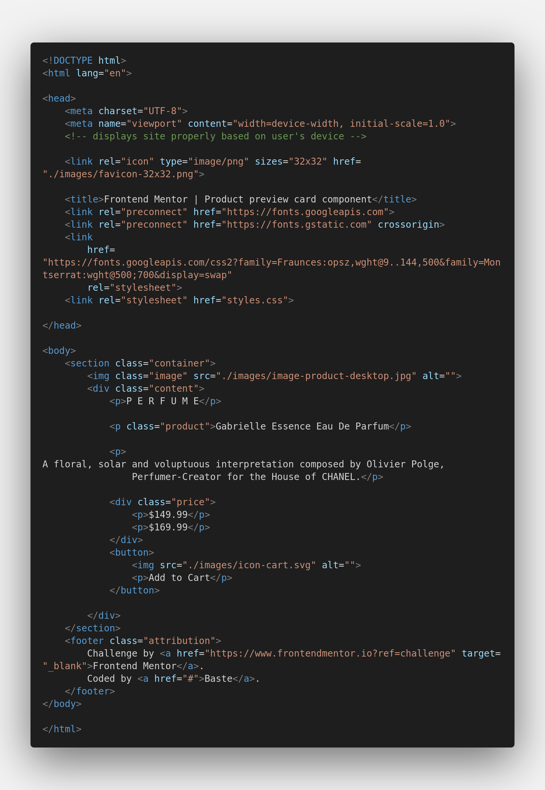
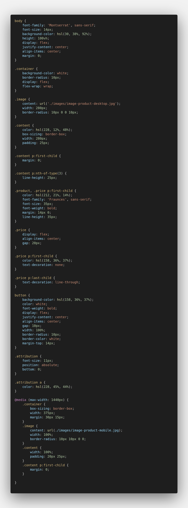

# Frontend Mentor - Product preview card component solution

This is a solution to the [Product preview card component challenge on Frontend Mentor](https://www.frontendmentor.io/challenges/product-preview-card-component-GO7UmttRfa). Frontend Mentor challenges help you improve your coding skills by building realistic projects. 

## Table of contents

- [Overview](#overview)
  - [The challenge](#the-challenge)
  - [Screenshot](#screenshot)
- [My process](#my-process)
  - [Built with](#built-with)
  - [What I learned](#what-i-learned)
  - [Continued development](#continued-development)
  - [Useful resources](#useful-resources)
- [Author](#author)

## Overview

### The challenge

Users should be able to:

- View the optimal layout depending on their device's screen size
- See hover and focus states for interactive elements

### Screenshot




## My process

### Built with

- Semantic HTML5 markup
- CSS custom properties
- Flexbox
- Mobile-first workflow

### What I learned

learned some css rules(change img source using css) and better understanding of flexbox(difference between align-items and align-content)

```html

```
```css
.image {
  content: url('#newsource')
}
```

### Continued development

learn more about css flexbox, css properties, margin and padding.

### Useful resources

- (https://stackoverflow.com/questions/2182716/is-it-possible-to-set-the-equivalent-of-a-src-attribute-of-an-img-tag-in-css) - css property for changing img src using css
- (https://www.youtube.com) - gives me a better understanding of css flexbox


## Author

- Frontend Mentor - [@Sebastianne Oblenida](https://www.frontendmentor.io/profile/Sebastianne-Oblenida)
